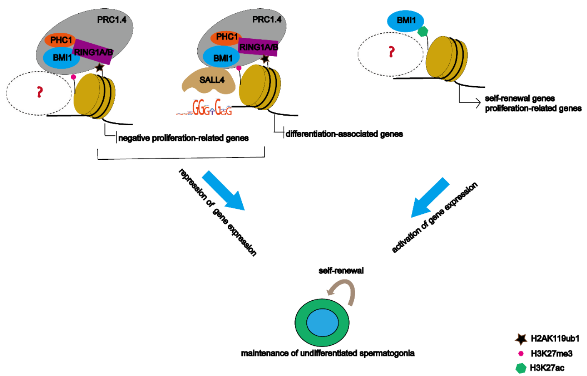

## #Code for analysis of NGS data

Spermatogenesis is sustained by the homeostasis of self-renewal and differentiation of undifferentiated spermatogonia throughout life, which is regulated by transcriptional and post-transcriptional mechanisms. The mechanistic underpinnings of how BMI1 regulates spermatogonia fate are little known. Our study reveals that BMI1 safeguards undifferentiated spermatogonia fate through multi-functional roles in regulating gene expression programs of undifferentiated spermatogonia.  

   

---
- snakefiles  
Snakemake workflows for NGS analysis, including ChIP-seq and RNA-seq.  
- R  
Scripts for data visualization using R packages.
